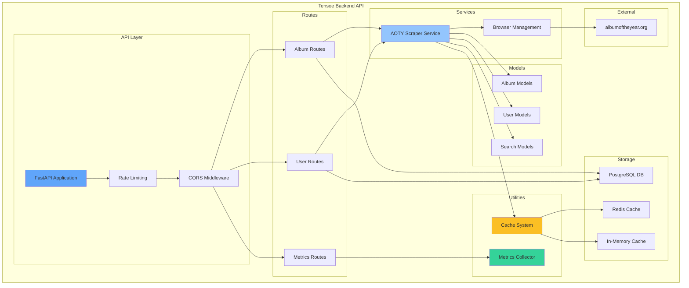

# Tensoe Backend Architecture

## System Overview

The Tensoe Backend API is a comprehensive music discovery platform that integrates Album of the Year (AOTY) functionality with a modern, scalable architecture.

## Architecture Diagram

## Component Descriptions

### API Layer

- **FastAPI Application**: Main application server with async support
- **Rate Limiting**: SlowAPI integration for request throttling (30/min default)
- **CORS Middleware**: Cross-origin resource sharing configuration

### Routes

- **Album Routes**: Handle album discovery, similar albums, and search functionality
- **User Routes**: Manage AOTY user profile retrieval and caching
- **Metrics Routes**: Provide API usage statistics and monitoring

### Services

- **AOTY Scraper Service**: Core web scraping using Playwright browser automation
- **Browser Management**: Shared browser instances for optimal performance

### Models

- **Album Models**: Pydantic models for album data, metadata, tracks, and reviews
- **User Models**: User profiles, statistics, and social information
- **Search Models**: Search results and discovery data structures

### Utilities

- **Cache System**: Multi-tier caching with Redis primary and in-memory fallback
- **Metrics Collector**: Real-time API usage tracking and performance monitoring

### Storage

- **Redis Cache**: Primary caching layer with configurable TTL
- **In-Memory Cache**: Fallback caching when Redis is unavailable
- **PostgreSQL DB**: Persistent data storage with SQLAlchemy integration

### External Dependencies

- **albumoftheyear.org**: Source website for music data and user information

## Data Flow

1. **Request Processing**:

   - Incoming requests hit the FastAPI application
   - Rate limiting middleware checks request frequency
   - CORS middleware handles cross-origin requests

2. **Route Handling**:

   - Requests are routed to appropriate handlers (Albums, Users, Metrics)
   - Cache is checked first for existing data
   - Metrics are recorded for monitoring

3. **Data Acquisition**:

   - Cache miss triggers the AOTY Scraper Service
   - Playwright browser automation extracts data from AOTY
   - Data is validated using Pydantic models

4. **Response & Caching**:
   - Processed data is cached with appropriate TTL
   - Response is sent to client
   - Metrics are updated with performance data

## Performance Optimizations

- **Browser Reuse**: Shared Playwright browser instances reduce overhead
- **Intelligent Caching**: Multi-tier strategy with Redis and in-memory fallback
- **Async Processing**: Full async/await support throughout the application
- **Connection Pooling**: Database connections managed efficiently
- **Rate Limiting**: Prevents abuse and ensures fair usage

## Monitoring & Observability

The system provides comprehensive metrics including:

- Request counts and response times
- Cache hit/miss ratios
- Error rates and types
- Endpoint-specific usage patterns
- Browser automation performance

Access real-time metrics at `/metrics/` endpoint.
